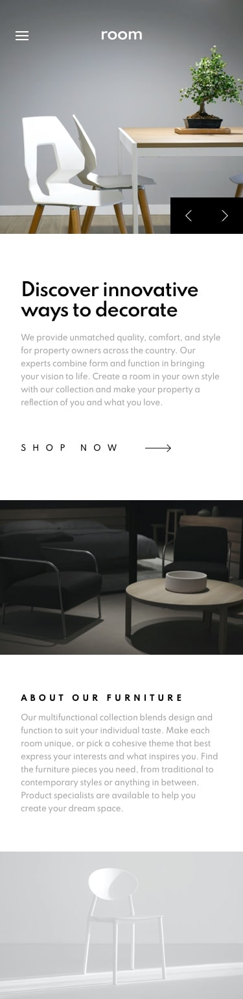

# Frontend Mentor - Room homepage solution - Rufi512

Hi everyone :wave: this is my first challenge that I do on this platform and I thought it would be fun to start with something in between (and it was) And well, in this challenge I wanted to try using only html, css and javascript nothing else but thinking about it a bit I decided to also use webpack to facilitate the import of resources in cases I get to use it and also to put together a small work area to continue making small web pages :stuck_out_tongue:

## Table of contents

- [Overview](#overview)
  - [The challenge](#the-challenge)
  - [Screenshots](#screenshots)
  - [Links](#links)
- [My process](#my-process)
  - [Built with](#built-with)
- [Author](#author)

## Overview

### The challenge 

Users should be able to:

- View the optimal layout for the site depending on their device's screen size
- See hover states for all interactive elements on the page
- Navigate the slider using either their mouse/trackpad or keyboard

### Screenshots

(**375px** - **1440px**) Width

| Mobile Design | Mobile Solution | 
|--|--|
|   |  |

| Desktop Design | Desktop Solution  | 
|--|--|
|   |   |

### Links

- Solution URL: [FrontendMentor Solution](https://www.frontendmentor.io/solutions/room-homepage-solution-html-css-js-webpack-nv4d5wjKw)

- Live Site URL: https://rufi512.github.io/room-homepage/

## My Process

### Built with

 - HTML (Lifelong)
 - CSS - Flexbox - Grid
 - Javascript
 - Webpack (To manage packages and more)
 - Flickity (To help me with the carrousel)

## Author

- Frontend Mentor - [@Rufi512](https://www.frontendmentor.io/profile/Rufi512)
- Twitter - [@Rufi512](https://twitter.com/rufi512)
